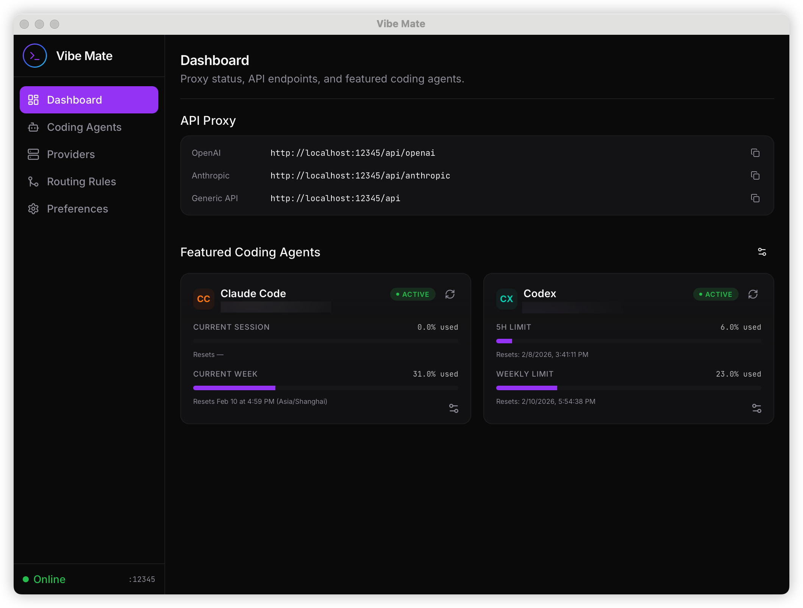

<div align="center">
  

  <h1>Vibe Mate</h1>

  <p><strong>Your ultimate companion for vibe coding — manage AI providers, coding agents, and routing rules from one beautiful desktop app.</strong></p>

  [](https://github.com/zhenlohuang/vibe-mate)
  [](LICENSE)
  [](https://tauri.app)
  [](https://react.dev)

  [Features](#-features) · [Screenshots](#-screenshots) · [Getting Started](#-getting-started) · [Development](#-development) · [Contributing](#-contributing)
</div>

---

## What is Vibe Mate?

Vibe Mate is a cross-platform desktop application that acts as a **smart proxy** between your AI coding agents (Claude Code, Codex, Gemini CLI, etc.) and LLM API providers. It lets you centrally manage multiple providers, define intelligent routing rules, and monitor agent usage — all from a sleek, modern interface.

**Why Vibe Mate?**

- Use multiple LLM providers simultaneously with a single proxy endpoint
- Route specific models to specific providers with glob pattern matching
- Rewrite model names for cross-provider compatibility
- Monitor coding agent quotas and authentication status in real time
- Configure everything through an intuitive GUI — no config files needed

## Features

- **Dashboard** — At-a-glance view of proxy status, API endpoints, and coding agent quotas with real-time usage tracking
- **Coding Agents** — Discover and manage Claude Code, Codex, Gemini CLI, and Antigravity with one-click login, quota monitoring, and configuration
- **Provider Management** — Add, edit, and test connections to any OpenAI-compatible or Anthropic-compatible API provider with latency checks
- **Smart Routing** — Priority-based routing rules with glob pattern matching (`gpt-4*`, `claude-*`), model rewriting, and drag-and-drop reordering
- **Proxy Server** — Built-in HTTP proxy on port 12345 with OpenAI, Anthropic, and Generic API endpoints, supporting streaming (SSE) responses
- **Preferences** — Configure upstream proxy (HTTP/HTTPS/SOCKS5) and no-proxy lists
- **Cross-Platform** — Native desktop app for macOS, Windows, and Linux powered by Tauri

## Screenshots

<div align="center">
  
  <p><em>Dashboard — Proxy endpoints and coding agent quota overview</em></p>
</div>

## Tech Stack

| Layer | Technologies |
|-------|-------------|
| **Frontend** | React 19, TypeScript, Vite, React Router 7, TanStack Query, Zustand |
| **UI** | Tailwind CSS v4, Radix UI, Motion, Lucide Icons |
| **Backend** | Rust, Tauri 2.0, Tokio |
| **Package Manager** | pnpm |

## Getting Started

### Prerequisites

- [Node.js](https://nodejs.org/) v18+
- [pnpm](https://pnpm.io/installation) v10+
- [Rust](https://www.rust-lang.org/tools/install) (latest stable)

### Quick Start

```bash
# Clone the repository
git clone https://github.com/zhenlohuang/vibe-mate.git
cd vibe-mate

# Install dependencies
pnpm install

# Launch the desktop app
pnpm tauri dev
```

### Web-only Development

For rapid UI iteration without the native shell:

```bash
pnpm dev
# Open http://localhost:1420
```

## Development

### Commands

| Command | Description |
|---------|-------------|
| `pnpm dev` | Start Vite dev server (web only) |
| `pnpm build` | Type-check and build frontend |
| `pnpm tauri dev` | Launch full desktop app with hot reload |
| `pnpm tauri build` | Build production desktop app |
| `pnpm tauri build --debug` | Debug build with symbols |
| `cd src-tauri && cargo test` | Run Rust tests |
| `cd src-tauri && cargo clippy` | Lint Rust code |

### Project Structure

```
vibe-mate/
├── src/                  # React frontend
│   ├── components/       # UI components (layout, ui, agents)
│   ├── pages/            # Route pages
│   ├── hooks/            # Custom hooks & Tauri IPC bridges
│   ├── stores/           # Zustand state stores
│   ├── lib/              # Shared utilities
│   └── types/            # TypeScript definitions
├── src-tauri/            # Rust backend
│   └── src/
│       ├── commands/     # Tauri IPC handlers
│       ├── services/     # Business logic & proxy server
│       ├── models/       # Data structures
│       └── storage/      # Persistent JSON storage
└── docs/                 # Documentation & assets
```

### Building for Production

```bash
# macOS
pnpm tauri build --target universal-apple-darwin

# Windows
pnpm tauri build --target x86_64-pc-windows-msvc

# Linux
pnpm tauri build --target x86_64-unknown-linux-gnu
```

Build artifacts are output to `src-tauri/target/release/bundle/`.

## How It Works

```
┌─────────────┐     ┌──────────────────┐     ┌──────────────┐
│ Claude Code  │     │                  │     │   OpenAI     │
│ Codex        │────▶│   Vibe Mate      │────▶│   Anthropic  │
│ Gemini CLI   │     │   Proxy :12345   │     │   Azure      │
│ Antigravity  │     │                  │     │   Custom     │
└─────────────┘     └──────────────────┘     └──────────────┘
   Coding Agents      Smart Routing            LLM Providers
```

1. Coding agents send API requests to the local proxy
2. The proxy extracts the model name from the request body
3. Routing rules (glob patterns, priority-based) determine the target provider
4. The proxy optionally rewrites the model name for provider compatibility
5. The request is forwarded with proper auth headers and streaming support

## Contributing

Contributions are welcome! Please:

1. Fork the repository and create a feature branch
2. Follow coding standards in [AGENTS.md](AGENTS.md)
3. Use [Conventional Commits](https://www.conventionalcommits.org/) (`feat:`, `fix:`, `docs:`)
4. Include screenshots for UI changes
5. Submit a PR with a clear description

## License

This project is licensed under the MIT License — see the [LICENSE](LICENSE) file for details.

---

<div align="center">
  <p>
    <a href="https://github.com/zhenlohuang/vibe-mate/issues">Report Bug</a>
    ·
    <a href="https://github.com/zhenlohuang/vibe-mate/issues">Request Feature</a>
  </p>
</div>
